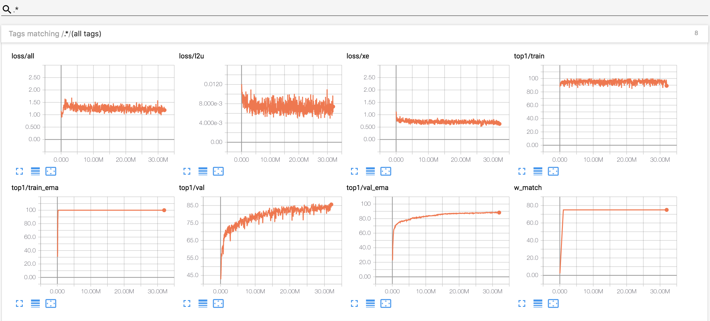

# MixMatch

This repo contains the unofficial pytorch implementation for the semi-supervised learning paper [MixMatch: A Holistic Approach to Semi-Supervised Learning](https://arxiv.org/abs/1905.02249).

## Requirements

* Python3: Anaconda is recommended because it already contains a lot of packages:
* `pytorch>=1.0`: Refer to https://pytorch.org/get-started/locally/
* other packages: `pip install tensorboardX tensorboard`

## Results

Tensorboard log on cifar10 dataset with 250 labeled data.

## Notes

Some codes is borrowed from https://github.com/google-research/mixmatch and https://github.com/YU1ut/MixMatch-pytorch. 
